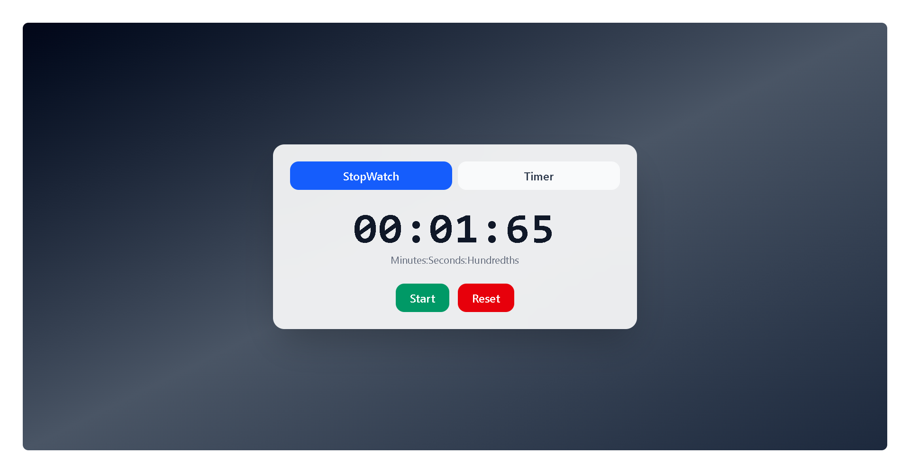

###⏱️ Timer & Stopwatch App (React + Tailwind)

A simple and elegant Timer & Stopwatch app built with React and styled using Tailwind CSS.
This project is created for practicing React hooks like useState, useEffect, and useRef.

🚀 Features

✅ Dual modes: Stopwatch and Timer

✅ Start, Pause, and Reset functionality

✅ Timer input (minutes & seconds)

✅ Clean UI with Tailwind CSS

✅ Interval cleanup using useEffect

✅ Responsive and modern design

🛠️ Technologies Used

React (Hooks: useState, useEffect, useRef)

Tailwind CSS for styling

📂 Project Structure
src/
├── components/
│ └── TimerStopWatch.jsx # Main component
├── App.jsx # Entry point
└── index.js # React DOM render

⚡ Installation & Setup

Clone this repo:

git clone https://github.com/your-username/timer-stopwatch.git
cd timer-stopwatch

Install dependencies:

npm install

Run the project:

npm run dev

App will start at http://localhost:5173/ (if using Vite).

### Stopwatch Mode

### Timer Mode

🎯 Learning Goals

This project was built to practice:

Using useState for managing app state

Using useRef for storing interval IDs and timestamps

Using useEffect for side effects (intervals, cleanup)

Tailwind for building a responsive UI

📌 Future Improvements

Add sound when the timer ends ⏰

Add lap functionality in Stopwatch 🏁

Save last timer duration in LocalStorage 💾

👨‍💻 Author

Hammad Ashraf 🚀

Future Full-Stack MERN Developer
